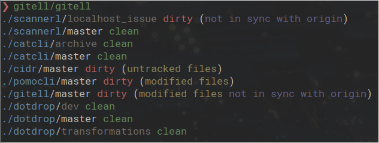

[](https://travis-ci.org/deadc0de6/gitell)
[](http://www.gnu.org/licenses/gpl-3.0)
[](https://aur.archlinux.org/packages/gitell-git)

# GITELL

*Quickly get multiple git repositories status*



If you manage multiple git repositories and want to quickly get
an overview of the status of those repositories, gitell can help.

Either provide it with directories to search for git repos to
inspect or run it directly from the location where all
your gits are.

# Usage

Per default gitell will search for git repositories in the
directory where it is called from.

```
$ ./gitell -h

gitell [-vs] [-d <depth>] [<path> ...]

	-d <depth> 	Depth to search for git directories (default: 4).
	-s		Use symbols instead of text.
	-h		Print usage.
	-v		Print version.
```

# Installation

Download `gitell` and copy it somewhere in your path.

```
wget https://raw.githubusercontent.com/deadc0de6/gitell/master/gitell -O /tmp/gitell
sudo cp /tmp/gitell /usr/bin/
```

Gitell is also available on [aur](https://aur.archlinux.org/packages/gitell-git/): [gitell-git](https://aur.archlinux.org/packages/gitell-git/).

# Related projects

These are similar projects that have inspired me for gitell:

* [https://github.com/StreakyCobra/gws](https://github.com/StreakyCobra/gws)
* [https://github.com/fboender/multi-git-status](https://github.com/fboender/multi-git-status)
* [https://github.com/MirkoLedda/git-summary](https://github.com/MirkoLedda/git-summary)

# Contribution

If you are having trouble using gitell, open an issue.

If you want to contribute, feel free to do a PR.

# License

This project is licensed under the terms of the GPLv3 license.
