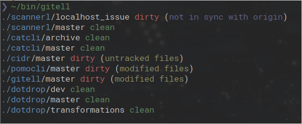

[](https://travis-ci.org/deadc0de6/gitell)
[](http://www.gnu.org/licenses/gpl-3.0)

# GITELL

*Quickly get multiple git repositories status*



# Usage

Per default gitell will search for git repositories in the
directories where it is called from.

```
$ ./gitell -h

gitell [-v] [-d <depth>] [<path> ...]

	-d <depth> 	Depth to search for git directories (default: 4).
	-h		Print usage.
	-v		Print version.
```

# Contribution

If you are having trouble using gitell, open an issue.

If you want to contribute, feel free to do a PR.

# License

This project is licensed under the terms of the GPLv3 license.
